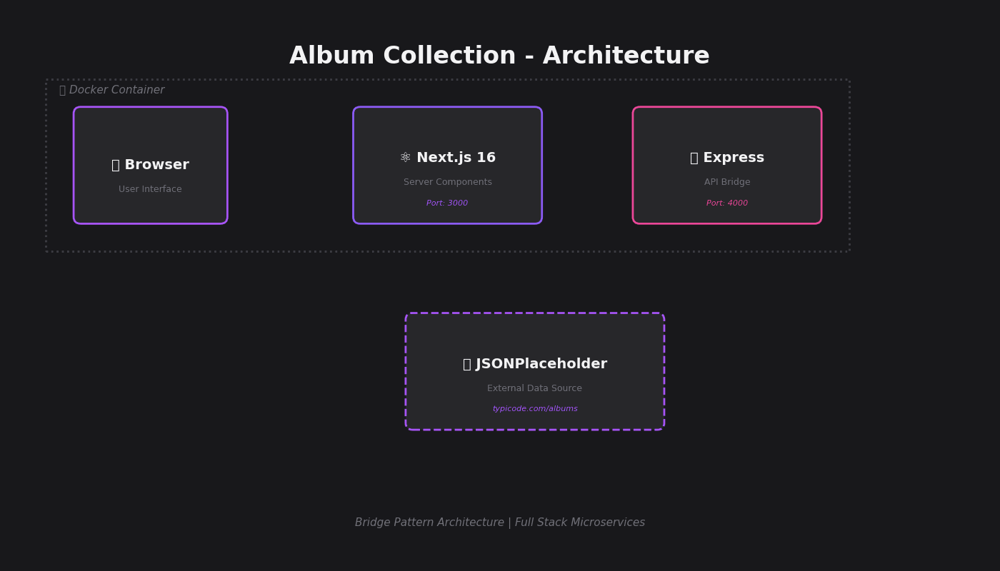
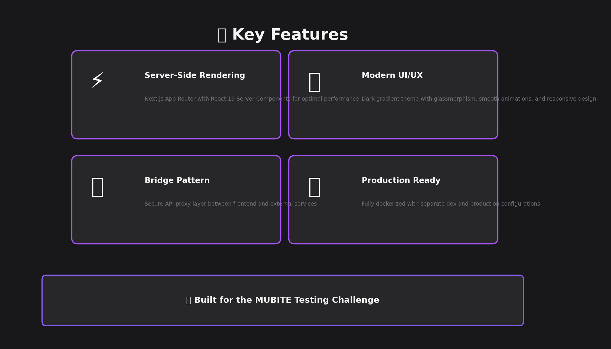
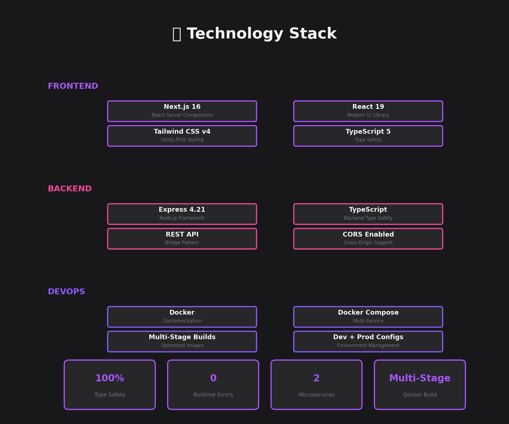

<div align="center">

# 🎵 Album Collection App

### A Modern Full-Stack Monorepo Application

**Built with Next.js 16 · Express · Tailwind CSS v4 · Docker**

[](https://nextjs.org/)
[](https://react.dev/)
[](https://expressjs.com/)
[](https://tailwindcss.com/)
[](https://www.docker.com/)
[](https://www.typescriptlang.org/)



*Professional microservices architecture demonstrating the Bridge Pattern*

[View Demo](#-quick-start) · [Report Bug](https://github.com/NovakDavid98/mubite-uchazec-novak/issues) · [Documentation](#-documentation)

</div>

---

## 📋 Table of Contents

- [✨ Features](#-features)
- [🏗️ Architecture](#️-architecture)
- [🛠️ Technology Stack](#️-technology-stack)
- [🚀 Quick Start](#-quick-start)
- [📁 Project Structure](#-project-structure)
- [🔌 API Endpoints](#-api-endpoints)
- [🐳 Docker Configuration](#-docker-configuration)
- [💻 Local Development](#-local-development)
- [📋 Requirements Compliance](#-requirements-compliance)
- [🎨 UI/UX Showcase](#-uiux-showcase)
- [📝 License](#-license)

---

## ✨ Features

<div align="center">

</div>

### 🎯 Core Capabilities

- **🔥 Server-Side Rendering** - Next.js App Router with React 19 Server Components for blazing-fast initial page loads
- **🎨 Modern Design System** - Dark gradient theme with glassmorphism effects, smooth animations, and responsive layouts
- **🔒 Bridge Pattern Architecture** - Secure API proxy layer between frontend and external services
- **🐳 Production-Ready** - Fully containerized with Docker and Docker Compose
- **⚡ Performance Optimized** - Multi-stage Docker builds, standalone Next.js output, and efficient caching strategies
- **🛡️ Type Safety** - 100% TypeScript coverage across frontend and backend
- **🔄 Hot Reload** - Separate development configuration with instant code updates
- **📱 Responsive Design** - Mobile-first approach with adaptive grid layouts (1-4 columns)

---

## 🏗️ Architecture

This application implements a **microservices architecture** using the **Bridge Pattern** to separate concerns and enable scalability.

```
┌─────────────────┐     ┌─────────────────┐     ┌─────────────────┐     ┌─────────────────┐
│                 │     │                 │     │                 │     │                 │
│    Browser      │────▶│   Next.js :3000 │────▶│  Express :4000  │────▶│ JSONPlaceholder │
│   (Client)      │◀────│  (Frontend)     │◀────│  (API Bridge)   │◀────│   (External)    │
│                 │     │                 │     │                 │     │                 │
└─────────────────┘     └─────────────────┘     └─────────────────┘     └─────────────────┘
      Request                Server Comp             REST Proxy              Data Source
                             TypeScript              TypeScript              JSON API
```

### Data Flow Explanation

1. **User Request** → Browser makes HTTP request to Next.js frontend
2. **Server Component** → Next.js fetches data via Express API (not directly from external source)
3. **API Bridge** → Express proxy requests data from JSONPlaceholder
4. **Response Chain** → Data flows back: External API → Express → Next.js → Browser
5. **Rendering** → Next.js server renders complete HTML with album data

### Why Bridge Pattern?

Even though this simple application doesn't strictly need an intermediary layer, the Bridge Pattern demonstrates:

- **Security** - Hide API keys and implement rate limiting
- **Caching** - Add Redis or in-memory cache at the proxy layer
- **Transformation** - Modify external data before sending to frontend
- **Monitoring** - Log all API calls in one centralized location
- **Scalability** - Replace external API without touching frontend code

---

## 🛠️ Technology Stack

<div align="center">

</div>

### Frontend Layer

| Technology | Version | Purpose |
|------------|---------|---------|
| **Next.js** | 16.0.5 | React framework with App Router and Server Components |
| **React** | 19.2.0 | UI library with latest concurrent features |
| **Tailwind CSS** | 4.x | Utility-first CSS framework for rapid styling |
| **TypeScript** | 5.x | Static typing for enhanced developer experience |

### Backend Layer

| Technology | Version | Purpose |
|------------|---------|---------|
| **Express** | 4.21.0 | Minimalist Node.js web framework |
| **TypeScript** | 5.x | Type-safe backend development |
| **Node.js** | 20 LTS | JavaScript runtime (Alpine Linux in Docker) |
| **CORS** | Enabled | Cross-origin resource sharing support |

### DevOps Layer

| Technology | Version | Purpose |
|------------|---------|---------|
| **Docker** | Latest | Container runtime for consistent environments |
| **Docker Compose** | v2 | Multi-container orchestration |
| **Multi-Stage Builds** | ✅ | Optimized production images |
| **Non-Root User** | ✅ | Security best practices (nextjs:nodejs) |

---

## 🚀 Quick Start

### Prerequisites

- **Docker** and **Docker Compose** installed
- **Ports 3000 and 4000** available

### Using Docker (Recommended)

#### Production Mode

```bash
# Clone the repository
git clone https://github.com/NovakDavid98/mubite-uchazec-novak.git
cd mubite-uchazec-novak

# Start both services
docker compose up --build

# Access the application
# Frontend: http://localhost:3000
# API: http://localhost:4000/api/albums
```

#### Development Mode (with Hot Reload)

```bash
# Start with development configuration
docker compose -f docker-compose.dev.yml up --build

# Code changes will auto-reload
```

### Without Docker

**Terminal 1 - Start API**
```bash
cd packages/api
npm install
npm run dev
# API running on http://localhost:4000
```

**Terminal 2 - Start Frontend**
```bash
cd packages/frontend
npm install
npm run dev
# Frontend running on http://localhost:3000
```

---

## 📁 Project Structure

```
mubite-uchazec-novak/
├── packages/
│   ├── frontend/                 # Next.js Application
│   │   ├── app/
│   │   │   ├── page.tsx         # 🏠 Main album list page (Server Component)
│   │   │   ├── layout.tsx       # Root layout with metadata
│   │   │   ├── globals.css      # Tailwind directives + custom styles
│   │   │   └── favicon.ico
│   │   ├── public/              # Static assets
│   │   ├── Dockerfile           # Multi-stage production build
│   │   ├── next.config.ts       # Next.js config (standalone output)
│   │   ├── tailwind.config.ts   # Tailwind v4 configuration
│   │   ├── tsconfig.json        # TypeScript configuration
│   │   └── package.json         # Frontend dependencies
│   │
│   └── api/                      # Express Backend
│       ├── src/
│       │   └── index.ts         # 🚀 Express server + bridge endpoint
│       ├── Dockerfile           # Multi-stage API build
│       ├── tsconfig.json        # Backend TypeScript config
│       └── package.json         # Backend dependencies
│
├── docker-compose.yml            # 🐳 Production configuration
├── docker-compose.dev.yml        # 🔧 Development configuration
├── .github/
│   ├── readme-assets/           # Generated visualization assets
│   └── generate_visuals.py      # Python script for README graphics
└── README.md                     # This file
```

---

## 🔌 API Endpoints

### Backend API (Express)

| Method | Endpoint | Description | Response |
|--------|----------|-------------|----------|
| `GET` | `/health` | Health check endpoint | `{"status": "ok"}` |
| `GET` | `/api/albums` | Fetch all albums (proxied from JSONPlaceholder) | Array of 100 album objects |

### Album Object Schema

```typescript
interface Album {
  userId: number;    // Owner of the album (1-10)
  id: number;        // Unique album ID (1-100)
  title: string;     // Album title
}
```

### Example Response

```json
[
  {
    "userId": 1,
    "id": 1,
    "title": "quidem molestiae enim"
  },
  {
    "userId": 1,
    "id": 2,
    "title": "sunt qui excepturi placeat culpa"
  }
]
```

---

## 🐳 Docker Configuration

### Production (`docker-compose.yml`)

**Optimized for deployment:**
- Multi-stage builds to minimize image size
- No source code mounted (immutable containers)
- Production environment variables
- Auto-restart policies
- Health checks enabled

```yaml
services:
  api:
    build: ./packages/api
    ports: ["4000:4000"]
    restart: unless-stopped
  
  frontend:
    build: ./packages/frontend
    ports: ["3000:3000"]
    depends_on: [api]
    restart: unless-stopped
```

### Development (`docker-compose.dev.yml`)

**Optimized for development:**
- Source code mounted as volumes
- Hot module replacement enabled
- `target: base` for faster rebuilds
- Development dependencies included
- Watch mode for TypeScript

```yaml
services:
  api:
    volumes:
      - ./packages/api/src:/app/src:ro
    command: npm run dev
  
  frontend:
    volumes:
      - ./packages/frontend/app:/app/app:ro
    command: npm run dev
```

### Dockerfile Features

Both services use **multi-stage builds**:

1. **Base Stage** - Sets up working directory
2. **Dependencies Stage** - Installs npm packages
3. **Builder Stage** - Compiles TypeScript / builds Next.js
4. **Runner Stage** - Minimal production image with only compiled assets

**Security:**
- Alpine Linux base (minimal attack surface)
- Non-root user (`nextjs:nodejs`)
- No build tools in final image

---

## 💻 Local Development

### Frontend Commands

```bash
cd packages/frontend

npm install          # Install dependencies
npm run dev          # Start development server (port 3000)
npm run build        # Build for production
npm start            # Start production server
npm run lint         # Run ESLint
```

### Backend Commands

```bash
cd packages/api

npm install          # Install dependencies
npm run dev          # Start with hot reload (tsx watch)
npm run build        # Compile TypeScript to JavaScript
npm start            # Start production server
```

### Environment Variables

**Frontend (`packages/frontend`)**
```env
API_URL=http://api:4000           # API endpoint (Docker) or http://localhost:4000 (local)
NODE_ENV=production               # Environment mode
NEXT_TELEMETRY_DISABLED=1         # Disable Next.js telemetry
```

**Backend (`packages/api`)**
```env
PORT=4000                         # Server port
NODE_ENV=production               # Environment mode
```

---

## 📋 Requirements Compliance

This project fulfills **all** requirements from the [MUBITE Testing Challenge](https://github.com/PetrBorak/mubite-uchazec):

| # | Requirement | Status | Implementation |
|---|-------------|:------:|----------------|
| 1 | Fork the repository | ✅ | This is a fork of `PetrBorak/mubite-uchazec` |
| 2 | Use JSONPlaceholder albums endpoint | ✅ | `packages/api/src/index.ts` line 21 |
| 3 | Create Next.js app calling the endpoint | ✅ | `packages/frontend/app/page.tsx` |
| 4 | Show list of albums | ✅ | Responsive grid with 100 albums |
| 5 | Use Tailwind for styling | ✅ | Tailwind CSS v4 with custom theme |
| 6 | Monorepo structure (frontend + backend) | ✅ | `packages/frontend` and `packages/api` |
| 7 | Bridge between Server Components and backend | ✅ | Next.js → Express → JSONPlaceholder |
| 8 | Use Express framework | ✅ | Express 4.21.0 with TypeScript |
| 9 | Dockerize with Docker and Docker Compose | ✅ | Multi-stage Dockerfiles + Compose |
| 10 | Production AND development Docker configs | ✅ | `docker-compose.yml` + `docker-compose.dev.yml` |
| 11 | Use Next.js App Router | ✅ | `app/` directory with Server Components |

### Additional Quality Enhancements

Beyond the requirements, this project includes:

- ✅ **TypeScript everywhere** - Full type safety
- ✅ **Error handling** - Try-catch blocks with meaningful messages
- ✅ **CORS enabled** - Cross-origin support
- ✅ **Security best practices** - Non-root Docker users
- ✅ **Performance optimization** - Standalone Next.js output
- ✅ **Professional UI** - Modern design with animations
- ✅ **Code quality** - ESLint configuration
- ✅ **Documentation** - Comprehensive README with visualizations

---

## 🎨 UI/UX Showcase

### Design Philosophy

The interface embraces a **dark-mode-first** design with:

- **Dark Gradient Background** - `zinc-900` to `zinc-800` for depth
- **Purple-Pink Accents** - Modern gradient from `purple-400` to `pink-500` to `red-500`
- **Glassmorphism** - Semi-transparent cards with backdrop blur
- **Smooth Animations** - Hover effects with `transform` and `shadow` transitions
- **Responsive Grid** - Adapts from 1 column (mobile) to 4 columns (desktop)

### Key UI Components

#### Album Card
```
┌─────────────────────────┐
│ 🎵 Icon       Badge: #1 │
│                         │
│ Album Title Here        │
│                         │
│ User #1                 │
└─────────────────────────┘
```

**Features:**
- Gradient ID badge in top-right corner
- Purple icon with gradient background
- Hover: Card lifts up with purple glow
- Capitalized title text
- User ID in muted color

### Responsive Breakpoints

```css
Mobile:    1 column  (< 640px)
Tablet:    2 columns (640px - 1024px)
Desktop:   3 columns (1024px - 1280px)
Large:     4 columns (≥ 1280px)
```

---

## 🤝 Contributing

This project was created for the MUBITE Testing Challenge. If you have suggestions:

1. Fork the repository
2. Create a feature branch (`git checkout -b feature/improvement`)
3. Commit your changes (`git commit -am 'Add improvement'`)
4. Push to the branch (`git push origin feature/improvement`)
5. Open a Pull Request

---

## 📝 License

This project is licensed under the **MIT License** - see the [LICENSE](LICENSE) file for details.

---

## 🙏 Acknowledgments

- **MUBITE** - For the challenging assignment
- **JSONPlaceholder** - For the free testing API
- **Vercel** - For Next.js and excellent documentation
- **Tailwind Labs** - For Tailwind CSS

---

<div align="center">

### 🚀 Built with passion for the MUBITE Testing Challenge

**[⬆ Back to Top](#-album-collection-app)**

---

Made by [David Novák](https://github.com/NovakDavid98) | 2026

</div>
